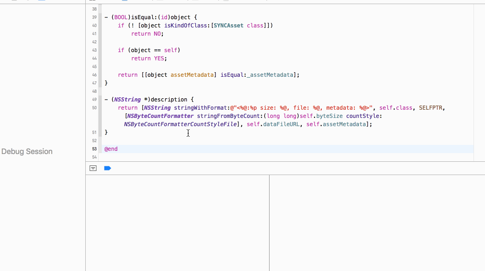

# Xcode: Documentation Popover is Misplaced on 3–Finger Tap
## Description
If you are using Xcode with a trackpad, there are two ways to bring up the inline documentation of a symbol:  
alt–clicking the symbol, and the three–finger–tap (given you’ve activated that gesture in “System Preferences” > “Trackpad”).

alt–clicking the symbol will display the documentation in a popover, that is rooted where you clicked.
This makes sense!  
The 3–finger tap, however, yields a popover that is rooted at the current insertion point.
At least in my typical use of the feature, the insertion point is somewhere else — very often even in a separate editor split.
So this behaviour leads to me searching for the popover a lot.

A screen recording of the faulty behaviour can be seen in .

## Steps to Reproduce
On a Mac with a trackpad…
1. Go to “System Preferences” > “Trackpad”, and ensure that the 3–finger tap gesture for lookup is activated.
2. In Xcode, open any source code file — e.g. NSURLRequest.h.
3. Place the insertion point somewhere in the file.
4. 3–finger tap on the type of any parameter or property.
5. Bonus: hit cmd–shift–o and type “httpresp” to quickly open NSURLResponse.h, directly jumping to the declaration of the NSHTTPResponse class.
6. Scroll until the name of the class is no longer within the editor window, and 3–finger–tap on some symbol name.

## Expected Results
In steps 4 and 6, the documentation popover is rooted at the mouse pointer, meaning the place where you 3–finger–tapped.

## Actual Results
In step 4, the popover is rooted at the insertion point — which is not where you tapped.
In step 6, it’s even worse: the popover isn’t displayed at all, because the “insertion point” is off screen.

## Version
Xcode Version 8.0 (8A218a)