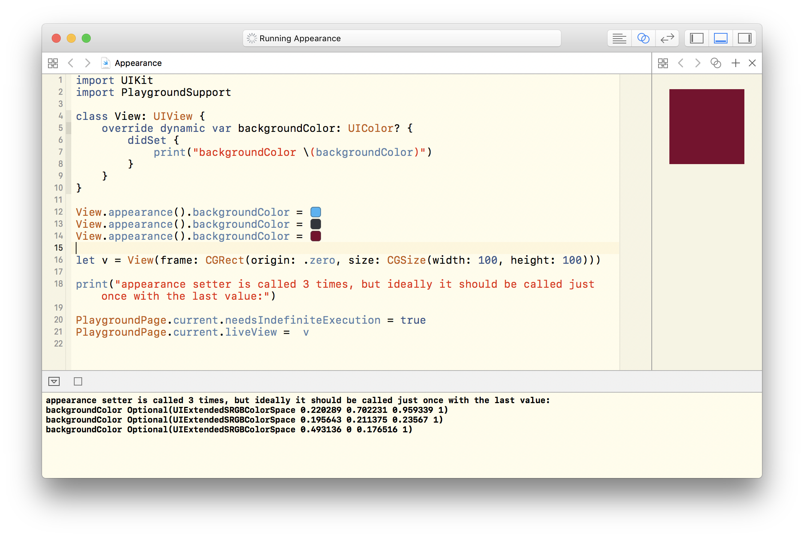

### UIAppearance setter called multiple times

http://www.openradar.me/28827675

Summary:
Calling the same setter on appearance proxy results in multiple calls on actual instance. Each proxy call results in one call on the actual instance.

Steps to Reproduce:
Attached Swift playground illustrates this behavior.

Expected Results:
The setter on the instance should be called just once and should reflect the last call on matching appearance proxy.

Actual Results:
All appearance proxy calls for particular selector are replayed on the matching instance.

Notes:
This is an issue when UIAppearance proxies are used to change the apps theme in runtime (e.g. switching between light/day and dark/night theme).

