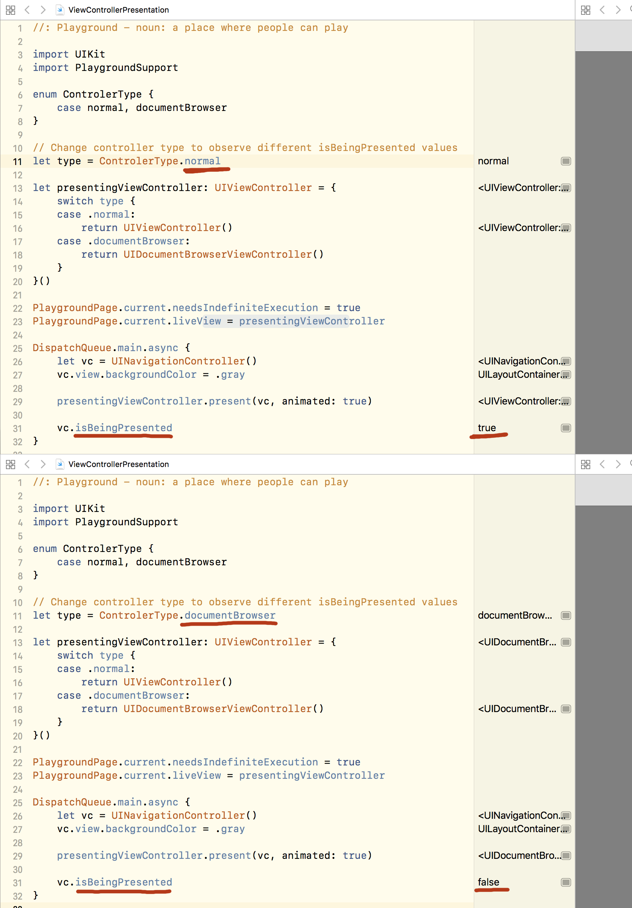

# isBeingPresented == false after presenting view controller from UIDocumentBrowserViewController

## Summary
After presenting view controller from UIDocumentBrowserViewController the presented view controller’s isBeingPresented property is still set to false.

## Steps to Reproduce
See attached playground.

## Expected Results
isBeingPresented should be set to true, which is the case when presenting form UIViewController.

## Actual Results
isBeingPresented is set to false.

## Version
11.2

## Notes
This is an unexpected inconsistency. There’s no way to detect that the controller is already being presented by inspecting it’s state. If you need to prevent from presenting the controller twice you need to track the state.

## Playground

