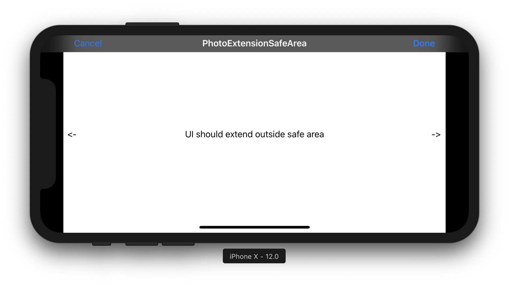
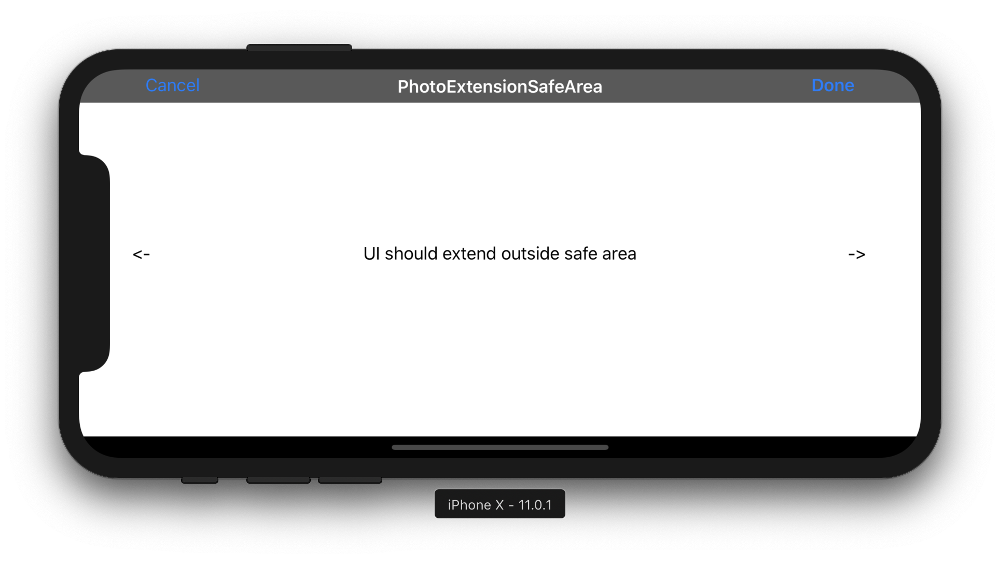
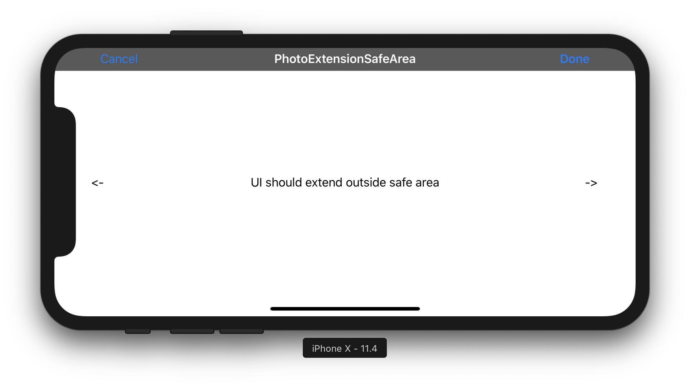

# Photo Editing Extension UI can't be extended outside horizontal safe area

http://www.openradar.me/45364385
rdar://45364385

Product:	iOS + SDK	
Product Version:	iOS 12.0 + 12.1b3
Classification:	UI/Usability	
Reproducible:	Always
 
Summary:
When running a Photo Editing Extension on a device that has left or right safe area insets, the UI can’t be extended outside the safe area, and there are black bars shown outside of the safe are on the left and right side. This currently affects iPhone X/XS (Max)/XR in landscape orientation. 

Note that this restriction does not occur with vertical safe area insets. The UI by default extends outside the top and bottom safe area insets. Therefore this issue can only be seen on iPhone X/XS (Max)/XR in landscape, and not in portrait.

This can be reproduced with an unmodified default Photo Editing Extension template created by Xcode. As well as with the attached sample project. Nothing in the sample project changes from the default template, apart from adding labels in the storyboard, and removing unused code and comments. Screenshots of the running Photo Editing Extension UI on various iOS versions has been added as attachment as well.

This issue has been reproduced on 12.0, 12.1b3 simulators and devices with Xcode 10.0 and 10.1b3.

Steps to Reproduce:
- Open the attached sample project
- Run the PhotoEditingExtension target on an iPhone X/XS (Max)/XR with iOS 12.0 or 12.1b.
- Edit a photo in Photos.app and choose the PhotoExtensionSafeArea Photo Editing Extension.
- Rotate the device/simulator to landscape.

Expected Results:
The UI provided from the app for the Photo Editing Extension extends outside the horizontal safe area.

Actual Results:
The UI provided from the app for the Photo Editing Extension does not extend outside the horizontal safe area. There are black bars on the right and left side outside the safe area.

Version:
iOS 12.0 + 12.1b3

Notes:
The behavior on iOS 11.3 or 11.4 was correct. The issue started happening in iOS 12.0. There was a different kind of issue on iOS 11.0, which has since been fixed.

The behavior on iOS 11.0 is actually inverted, where the UI extends outside the horizontal safe area, but not outside the vertical safe area (the UI doesn’t extend below the home indicator, but is cut off above).

Screenshots:
iOS 12.0 - Wrong behavior:

iOS 12.1b3 - Wrong behavior:

iOS 11.0 - Different wrong behavior:

iOS 11.4 - Correct behavior:

