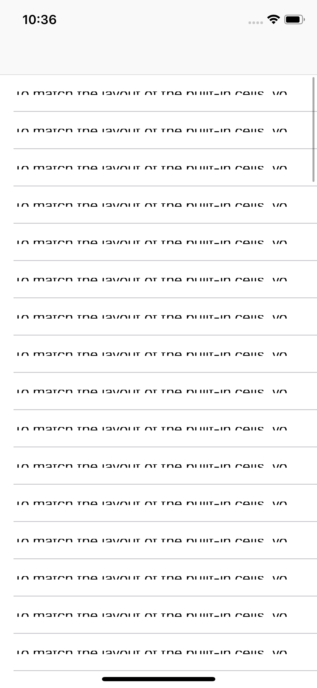
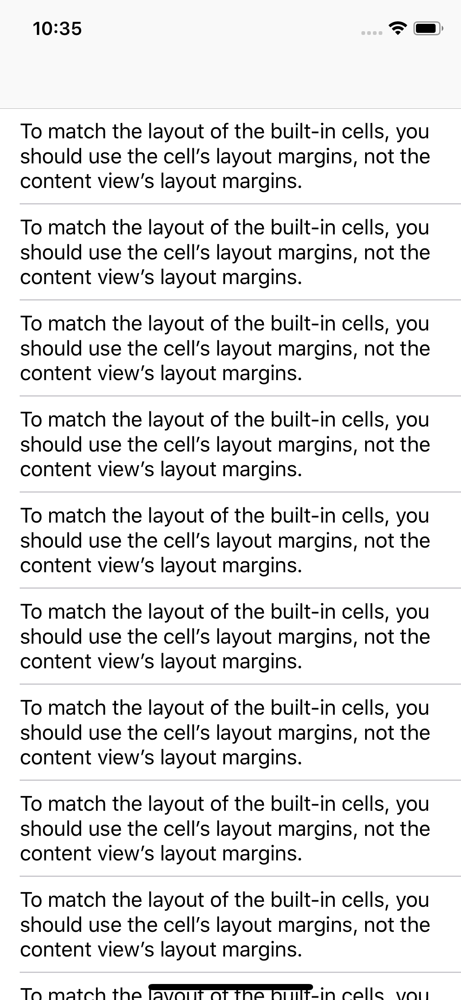
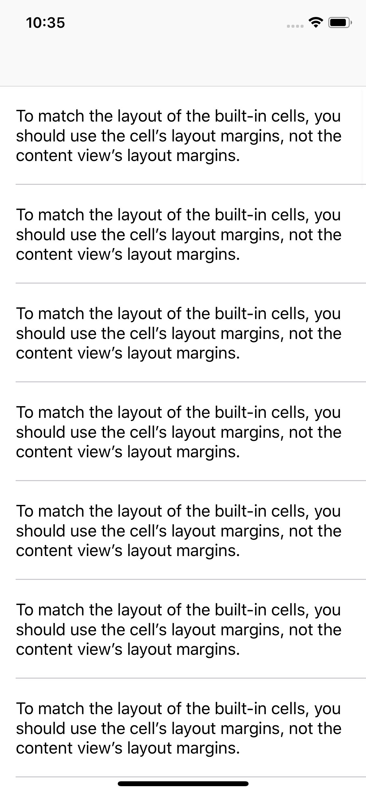

# Constraints to UITableViewCell layoutMarginsGuide do not work

http://openradar.appspot.com/46234942

| Cell margins | Content view margins | Content view margins preserving superview margins |
| -------------- | ------------- | ----- |
|  |  |  |
 
## Summary:
When laying out a UITableViewCell subclass, you probably want to respect the margins correctly.

To match the layout of UIKit’s built-in table view cell subviews, you should use the cell’s layout margins, not the `contentView`’s layout margins. The cell’s vertical margins increase with the Dynamic Type text size, while the content view’s margins do not.

However, making constraints involving the cell’s `layoutMarginsGuide` results in cells always being 44 points tall.

## Steps to Reproduce:
Run the attached sample project.

You can see it’s very simple. Just shows cells where a single label fills the cell’s margins.

## Expected Results:
The cells should be correctly self-sized so the text fits. The vertical margins should be thicker at large text sizes to match the layout if we’d used UITableViewCell and it’s textLabel instead of our custom label.

## Actual Results:
UIKit logging this warning and uses a height of 44 points.

> Warning once only: Detected a case where constraints ambiguously suggest a height of zero for a tableview cell's content view. We're considering the collapse unintentional and using standard height instead.

## Version:
12.1

## Notes:
Workaround: Set preservesSuperviewLayoutMargins on the contentView and set up constraints to the contentView’s layoutMarginsGuide. This is fine now I know, but it would be nice for other developers if

• Using the cell’s margins didn’t break.
• Using the contentView’s margins (without preservesSuperviewLayoutMargins) didn’t result in an inferior layout that a lot of people probably won’t notice because they won’t test with larger text sizes.
